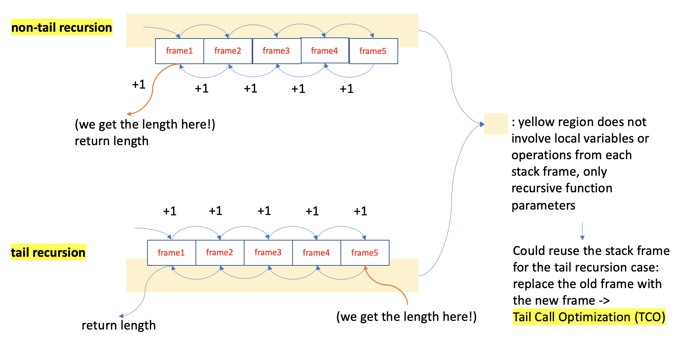

[TOC]


## Tail Recursion

#### What is tail recursion?

Tail recursion refers to the type of recursion where the result of a recursive call is **immediately** returned to the caller and there is nothing to excute (computation or others) after the recursive call on that level. More concretely, let's look at two recursive ways to count the length of a linked list.

```java
public class TryOut {

    //non-tail recursion
    public int countNonTail(ListNode node){
        if (node.next == null) {
            return 1;
        }
        return countNonTail(node.next) + 1;
    }

    //tail recursion
    public int countTail(ListNode node, int length) {
        if (node == null) {
            return length;
        }
        length++;
        return countTail(node.next, length);
    }

    public static void main(String[] args) {
        TryOut t = new TryOut();
        ListNode n1 = new ListNode(1, null);
        ListNode n2 = new ListNode(2, n1);
        ListNode n3 = new ListNode(3, n2);
        ListNode n4 = new ListNode(4, n3);
        ListNode n5 = new ListNode(5, n4);

        System.out.println(t.countNonTail(n5));
        //-> 5
        System.out.println(t.countTail(n5, 0));
        //-> 5

    }
}

class ListNode {
    int val;
    ListNode next;
    ListNode (int val, ListNode nextNode) {
        val = val;
        next = nextNode;
    }
}

```

In the example above, countNonTail() will traverse all the way to the last node and then increament the returned length as the program goes from the last node to the previous one. This is a non-tail recursion because the last excutions are the recursive call -> increment result by 1 -> return: the last execution is not the recursive call.

On the other hand, countTail() also takes in an integer as parameter and increment the length by 1 as the programs traverse to the last node. When it reaches the last node, the length has been calculated and thus only need to be passed to the first node.

The following graph visuals the execution process and stack frame of the two methods above. Notice non-tail recursion, in which increment logic is before the recursive call, actually start performing the length calculation from **the last node** and then backward. On the other hand, the tail recursive case, the length calculation starts from **the first node** and then forward. This observation is particularly important, as it give hints on how to recursively solve list-related algorithm problems where each ListNode correspond a stack frame **(to do....insert a link to an article about reverse linked list recursively)**.



#### Tail Call Optimization

It can been seen from the graph above that in each methods, there is a yellow region where the program does not do nearly anything but racing to the last stack frame or the first stack frame. Let's focus on the tail recursion: we get the final result at the last stack and the rest of the program is to pass that result stack frame by stack frame to the main frame. Is there any improvement that we can do?

The answer is yes, through Tail Call Optimization (TCO). Here is how it will work: after the first stack frame does its thing and pass the parameters to the next stack frame, the new stack frame, rather than lay on the old frame, **replace** the old stack frame. Why are we allowed to do this? Because the nature of tail recusion: there is nothing we will need from the old stack frame: no particular local variables, no lingering logic (print, increment..), no nothing! Therefore, we can safely abondon the old stack frame. When we get the final result at the last stack frame, we just return it! The space complexity for the call stack goes from O(n) before optimization to O(1) after optimization.

Let's also take a look at the non-tail recusion case and why there can't be a similar optimization. For the non-tail recursion case, the yellow region happens before the increment logic: after the reached the last stack frame, we haven't performed any real logic that contribute to the result. As we go back the previous stack frames one by one, we increment the length -- can we know this logic (increment by 1) if we get rid of the old stack? No. Therefore we have to keep all the old stack frames. And this is exactly why tail recursion is defined as such and can get rid of older stack frames: no operations(logic) will be performed after the recursive call, the older stacks frames (which contains local variables and logic) are not needed!

So things are good and we understand why TCO can save space by getting rid of old stack frames. And here is the bad news: as of 2020, Java does not implement Tail Call Optimization.

Why doesn't Java implement Tail Call Optimization, you ask? Brian Goetz is the Java Language Architect at Oracle and he gave an explanation on precise the reason during one of his speech:

​	*"In JDK classes...there are a number of security sensitive methods that rely on counting stack frames between jdk library code and calling code to figure out who's calling them....(Tail Call Optimization) will eventually get done."*

There you have it: Tail Call Optimization is good but a rigid frame-counting mechanism from the 1990s has been stopping Oracle from implementing TCO and Tail Call Optimization is not exactly an priority for them at this point. However, we should expect this feature will come to life in the upcoming years. In the meantime, here is the good news: it has been proved by computer scientists, that any tail recursion, compared to non-tail recursion, can be relatively easily rewritten to an iterative method using a loop. Next, we will review the basics of how we perform this recursion-iteration conversion.

References:

1. An article on tail recursion from Cornell University. https://www.cs.cornell.edu/courses/cs3110/2019sp/textbook/data/tail_recursion.html
2. Visualization of call stacks of tail and non-tail recursion. https://www.youtube.com/watch?v=o2nQDij5eqs
3. Explanation on tail recursion from Tutorials Point. https://www.youtube.com/watch?v=HdZix3H9ZI4
4. Brian Goetz (Java Language Architect at Oracle) on why Java has yet to implement Tail Call Optimization. https://www.youtube.com/watch?v=2y5Pv4yN0b0&t=1h02m18s


## Recursion-Iteration Conversion

base case is stopping condition in loop.